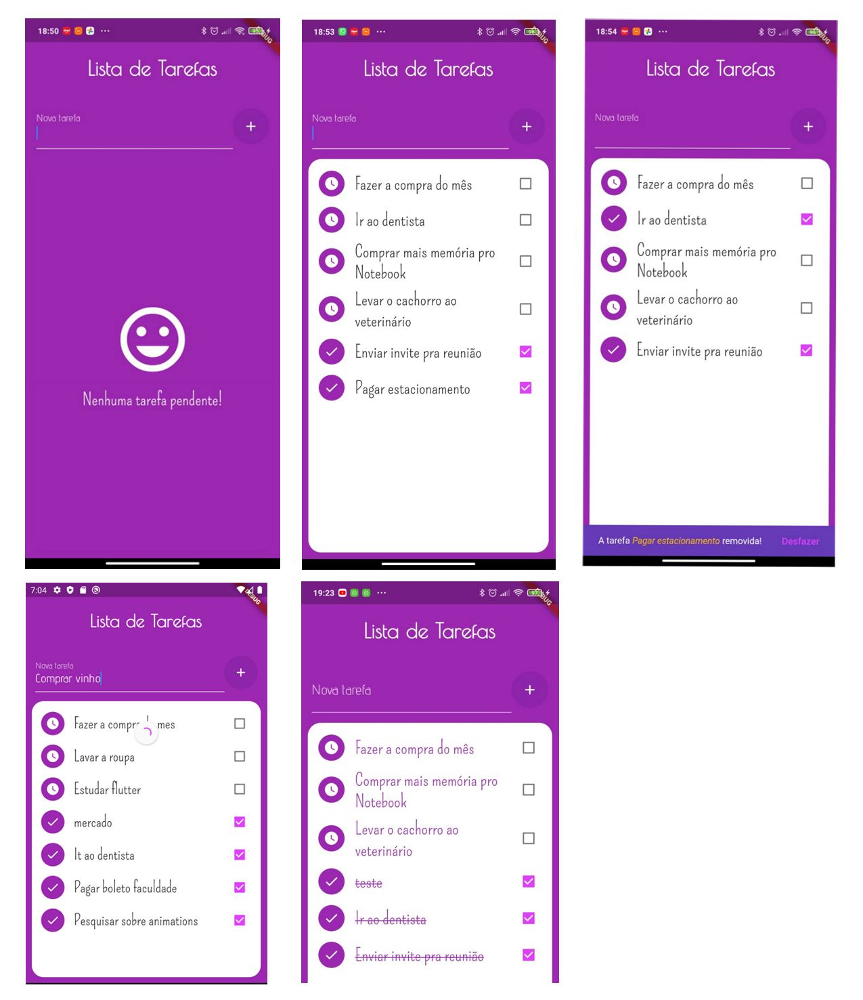

# Task List

Lista de tarefas desenvolvido em Flutter

### Screenshots

#### Widget e recursos utilizados
 - Armazenamento de dados em arquivo
 - CheckboxListTile
 - SnackBar
 - CircleAvatar
 - GoogleFonts
 - Dismissible
 - RefreshIndicator
 - Uso de Future (async ... await)
 - ThemeData
 - Scaffold
 - RichText
 - FloatingActionButton
 
 
